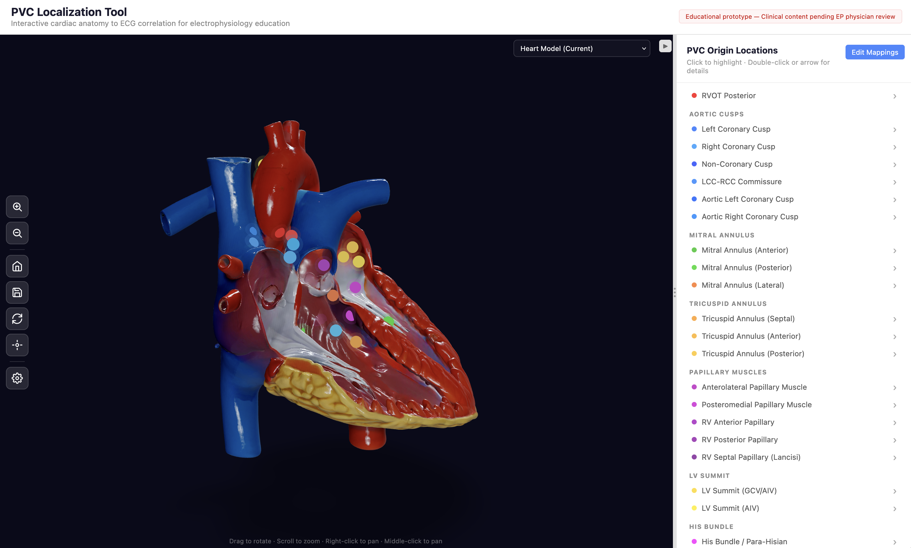

# PVC Heart Localization Tool

Interactive 3D cardiac anatomy viewer for mapping premature ventricular contraction (PVC) origins to 12-lead ECG morphologies. Built for electrophysiology education.



## Quick Start

```bash
npm install
npm run dev
```

Open `http://localhost:5173` in your browser.

## Project Structure

```
src/
├── App.tsx                          # Main layout, routing between views
├── components/
│   ├── HeartViewer.tsx              # 3D canvas, lighting, camera, hotspots
│   ├── HeartModel.tsx               # GLB loader, auto-center/scale, BVH acceleration
│   ├── CameraController.tsx         # Orbit controls, smooth zoom, reset view
│   ├── ViewerControls.tsx           # Toolbar: zoom, rotate, brightness slider
│   ├── Hotspot.tsx                  # Clickable PVC origin markers on heart surface
│   ├── MappingPanel.tsx             # Interactive hotspot position mapping tool
│   ├── ECGPanel.tsx                 # 12-lead ECG display
│   ├── ClinicalInfoPanel.tsx        # Clinical descriptions, ECG features, references
│   ├── RegionList.tsx               # Selectable PVC origin list
│   └── ResizablePanel.tsx           # Collapsible horizontal split panel
├── data/
│   ├── pvcOrigins.ts                # Clinical data for all PVC origins (23 entries)
│   ├── ecgProfiles.ts               # Literature-derived per-lead ECG morphology profiles
│   └── modelConfigs.ts              # Per-model configs: file, hidden meshes, hotspot positions
public/
├── models/
│   └── university-of-dundee-interior-heart-high-detail.glb  # Active model (11MB, Draco-compressed)
├── ecg/                             # ECG images (pending EP physician sourcing)
```

## Heart Model

The active model is **Interior Heart — High Detail** from the [University of Dundee CAHID](https://sketchfab.com/3d-models/interior-heart-high-detail-7a592ce3b0514258ad4c4ef9e18b8f8e). All 23 PVC origin hotspots are mapped to this model. The model switcher UI is currently disabled per EP physician guidance — a single, well-mapped model is preferable to multiple partially-mapped alternatives.

The model config system (`src/data/modelConfigs.ts`) still supports multiple models. To re-enable the switcher or add a new model:

1. Drop a `.glb` file into `public/models/`
2. Add a config entry in `src/data/modelConfigs.ts`
3. Map all 23 hotspot positions using Mapping Mode
4. Re-enable the model selector in `HeartViewer.tsx`

## Mapping Mode

Maps PVC origin hotspot positions to any heart model — no code changes needed.

1. Open the app, ensure no PVC origin is selected (right panel shows the list)
2. Click **"Edit Mappings"** button in the right panel header
3. Click on the heart surface to place a marker
4. Select the PVC origin from the dropdown to assign that position
5. Repeat for all origins — green markers show mapped positions
6. Click **"Copy mappings as JSON"** to export, then paste into `modelConfigs.ts`
7. Click **"Exit"** to return to normal mode

## Viewer Controls

| Action | Input |
|--------|-------|
| Rotate | Left-click drag |
| Zoom | Scroll wheel / toolbar buttons |
| Pan | Right-click drag / middle-click drag |
| Zoom inside model | Scroll past the surface (min distance = 0) |
| Reset view | Toolbar button |
| Auto-rotate | Toolbar toggle (off by default) |
| Brightness | Vertical slider on toolbar (10%–300%) |
| Collapse right panel | Chevron button or double-click divider |

## Tech Stack

- **React 19** + **TypeScript**
- **React Three Fiber** + **Three.js** — 3D rendering
- **@react-three/drei** — OrbitControls, useGLTF, Environment, ContactShadows
- **three-mesh-bvh** — BVH acceleration for fast raycasting on high-poly models
- **Vite** — dev server and build

## Deploying to Vercel

### Prerequisites

- [Vercel CLI](https://vercel.com/docs/cli): `npm install -g vercel`
- Authenticate: `vercel login`

### First-time setup

```bash
vercel --prod --yes
```

This will:
1. Create a Vercel project linked to the repo
2. Upload source + model files (under 100MB each)
3. Run `npm run build` on Vercel's servers
4. Deploy to a `.vercel.app` URL

### Subsequent deploys

```bash
vercel --prod --yes
```

Or connect the GitHub repo for auto-deploys (Vercel dashboard → Project Settings → Git → Connect).

### Model file limits

Vercel has a **100MB per-file limit** for static assets. The `.vercelignore` file excludes any oversized source models. The active model is Draco-compressed (11MB) and served via Vercel's CDN with 1-year cache headers (`vercel.json`).

### Optimizing new models

Use `gltf-transform` to apply Draco compression before deploying:
```bash
npx @gltf-transform/cli optimize input.glb output.glb --compress draco
```
Drei's `useGLTF` has built-in Draco decoder support — no code changes needed.

### Current deployment

Live at: **https://pvc-heart-tool.vercel.app**

---

## Key Design Decisions

- **Single curated model** — Using only the University of Dundee Interior Heart (high detail) model with all 23 PVC origins mapped. A well-mapped model beats multiple poorly-mapped alternatives.
- **Hotspot overlay approach** — clickable markers placed at 3D coordinates, not mesh segmentation. Works with any single-mesh heart model. See `Guide-3D-Model-Preparation.md` for alternatives.
- **Per-model config system** — the infrastructure supports multiple models (configs in `modelConfigs.ts`), but the UI currently shows only one. New models can be added and mapped without changing the architecture.
- **Clinical accuracy first** — all content is AI-drafted with citations but gated behind `reviewStatus: "draft"` until EP physician validates. See `PVC-Heart-Visualization-Project-Plan.md` for the full content pipeline.

## Other Models (Not Currently Active)

These models have config entries in `src/data/modelConfigs.ts` but are not mapped with PVC hotspot positions and are not shown in the UI. They may be useful for future iterations.

| Model | Size | Source | Notes |
|-------|------|--------|-------|
| Human Heart Internal Structure 3D Model | 5.3MB | [Haiqa Arif (Sketchfab)](https://sketchfab.com/3d-models/human-heart-internal-structure-3d-model-21d346f72230432e8ed5fe448b03cca5) | Cut-out section revealing chambers and valves |
| Heart Model (Medium) | 3.8MB | Source pending | Compressed from `heart-1.glb` |
| 3D EduTex Human Heart | 14KB | [3D EduTex (Sketchfab)](https://sketchfab.com/3d-models/human-heart-f5fa1e719f3d4f28a7c31728a86a9b42) | External surface only — no interior structures |

See [`heart-models.md`](./heart-models.md) for a full curated list of candidate heart models (including cross-sectional and interior views).

## Documentation

- [`REFERENCES.md`](./REFERENCES.md) — **Complete bibliography**: all peer-reviewed citations, ECG profile sources, anatomical mapping references, and 3D model attributions
- [`PVC-Heart-Visualization-Project-Plan.md`](./PVC-Heart-Visualization-Project-Plan.md) — Full project plan, architecture, clinical accuracy requirements, progress log
- [`Guide-3D-Model-Preparation.md`](./Guide-3D-Model-Preparation.md) — How to prepare and evaluate heart models (hotspot vs segmentation approaches)
- [`heart-models.md`](./heart-models.md) — Curated links to free heart 3D models (external surface + cross-sectional)
